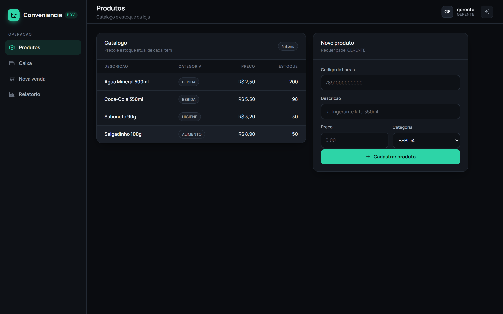
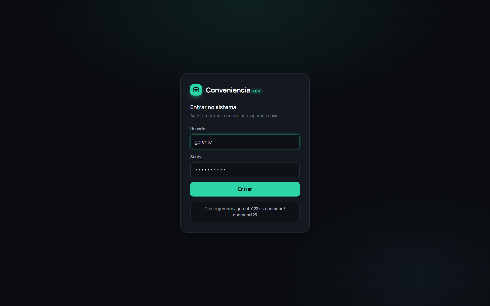
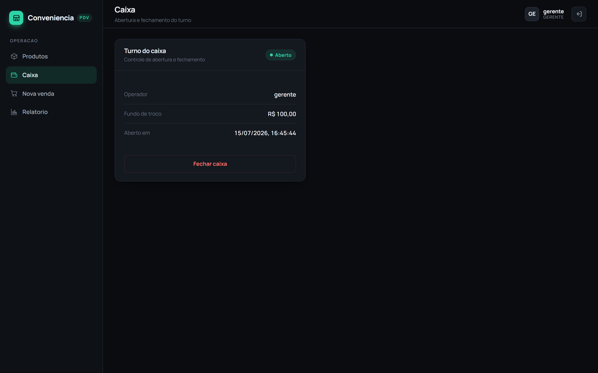
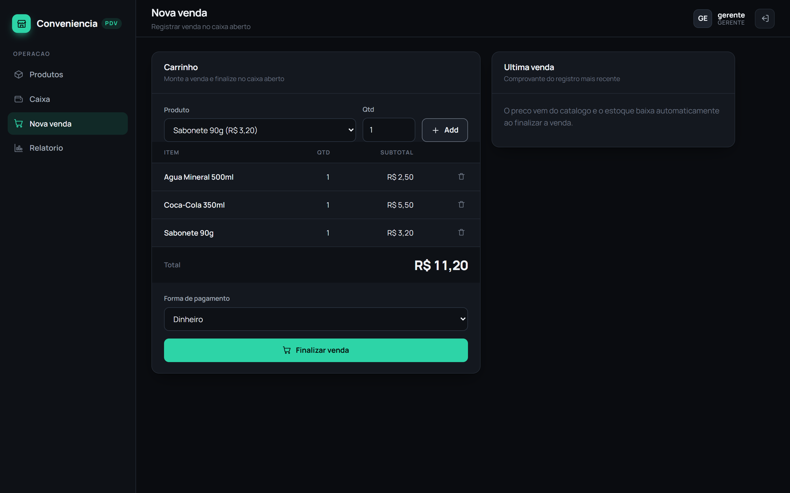
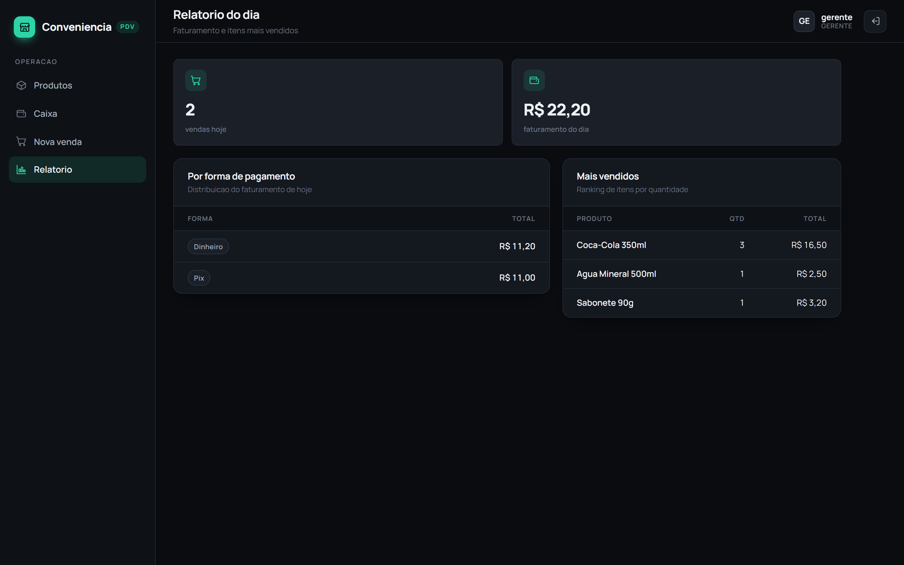
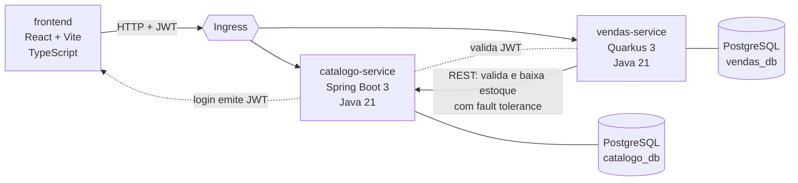
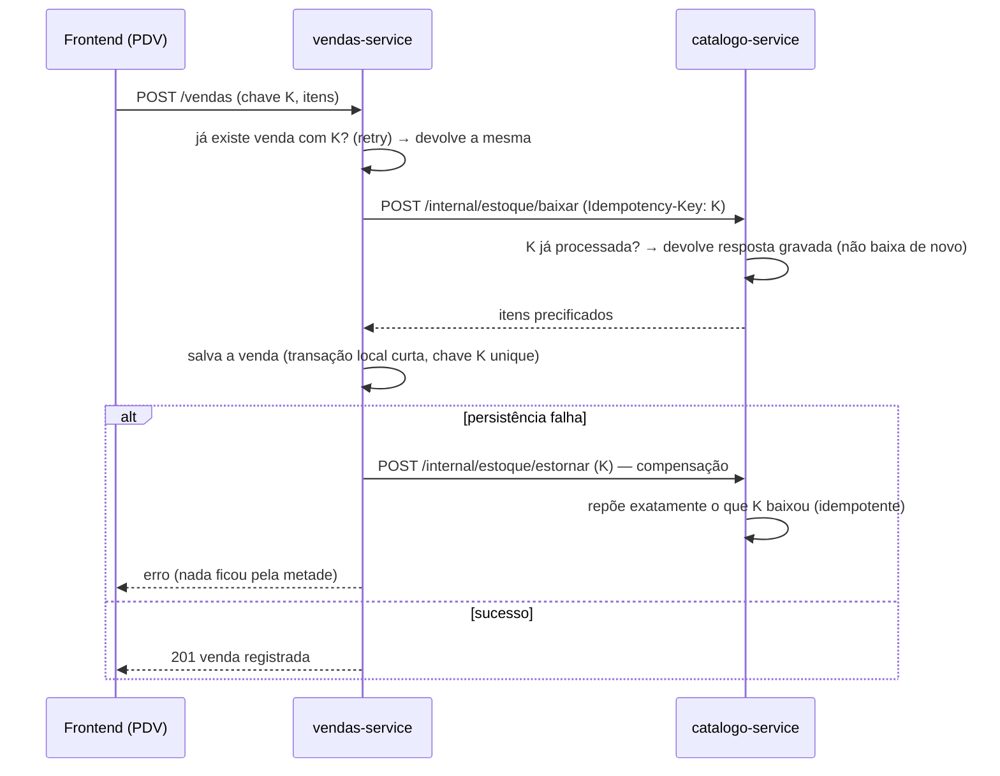

# Sistema de Controle de Vendas de Conveniência

Backend em **microserviços Java** para o dia a dia de uma loja de conveniência:
cadastro de produtos, controle de estoque, registro de vendas, caixa por turno e
relatórios. Construído com duas stacks diferentes de propósito, para demonstrar
domínio das duas, e preparado para rodar em **Kubernetes**.


> Projeto de portfólio. O objetivo é mostrar arquitetura de microserviços,
> boas práticas de engenharia (Clean Architecture, DDD, testes, observabilidade,
> resiliência) e a operação em contêineres e Kubernetes.

## Interface

Front-end **SPA em React + TypeScript** que consome os dois microserviços com o
mesmo JWT. Layout de PDV com navegação lateral, tema escuro e componentes de
dashboard (cards, tabelas, KPIs e indicadores de estado).

<p align="center">
  
</p>

<table>
  <tr>
    <td width="50%"><br><sub><b>Login</b> com JWT emitido pelo catálogo</sub></td>
    <td width="50%"><br><sub><b>Caixa por turno</b> com fundo de troco e estado</sub></td>
  </tr>
  <tr>
    <td width="50%"><br><sub><b>Nova venda</b>: carrinho, total e forma de pagamento</sub></td>
    <td width="50%"><br><sub><b>Relatório do dia</b>: faturamento e mais vendidos</sub></td>
  </tr>
</table>

## Arquitetura

Dois serviços independentes, cada um dono do seu banco (padrão *database per
service*), comunicando por REST. Um usa **Spring Boot**, o outro **Quarkus**, de
propósito.



Um **frontend React** (SPA) consome os dois serviços via REST, com o mesmo JWT.
Ele faz login, lista produtos, controla o caixa, registra vendas e mostra os
relatorios.

| Serviço | Stack | Contexto (DDD) | Porta | Responsabilidade |
|---|---|---|---|---|
| **catalogo-service** | Spring Boot 3, Java 21 | Catálogo e Estoque, Identidade | 8081 | Produtos, categorias, estoque, login e emissão de JWT |
| **vendas-service** | Quarkus 3, Java 21 | Vendas e Caixa | 8082 | Registro de venda, itens, caixa por turno, relatórios |

- **Autenticação:** o `catalogo-service` autentica o operador e emite um **JWT
  (HS256)**. Os dois serviços validam o token com um segredo compartilhado
  (injetado por *Secret* no Kubernetes). Em um sistema maior isso seria um
  `identity-service` dedicado; aqui fica no catálogo para manter o escopo enxuto,
  e a decisão está documentada em [docs/ARCHITECTURE.md](docs/ARCHITECTURE.md).
- **Comunicação entre serviços:** ao registrar uma venda, o `vendas-service`
  chama o `catalogo-service` para validar o produto e **dar baixa no estoque**,
  com *timeout*, *retry* e *circuit breaker* (fault tolerance). A baixa é
  **idempotente** por `Idempotency-Key` e tem **estorno de compensação** — ver a
  seção de consistência abaixo.
- **Banco por serviço:** cada serviço tem seu PostgreSQL e suas migrações Flyway.
  Nada de banco compartilhado.

Detalhes das decisões, contexto delimitado e contrato entre serviços em
**[docs/ARCHITECTURE.md](docs/ARCHITECTURE.md)**.

## Consistência entre serviços: idempotência + compensação (saga)

Registrar uma venda envolve **dois bancos diferentes** (estoque no catálogo,
venda no vendas) — e rede no meio. Dois problemas clássicos são tratados:

1. **Retry duplicando estoque:** o retry automático só é seguro porque a baixa é
   **idempotente**: o frontend gera uma `Idempotency-Key` por venda, o catálogo
   grava cada operação processada e, se a mesma chave chegar de novo (timeout,
   clique duplo), devolve a resposta gravada **sem baixar de novo**. A mesma
   chave torna o registro da venda idempotente no `vendas-service` (constraint
   `unique` no banco garante, mesmo sob concorrência).
2. **Falha no meio do caminho:** se a venda falhar **depois** do estoque baixado,
   o `vendas-service` **compensa**: pede o estorno da baixa (saga de dois passos).
   O estorno repõe exatamente o que a baixa tirou e também é idempotente —
   estornar duas vezes não repõe duas vezes.



A transação com o banco local é **curta e não engloba a chamada remota** (nada
de segurar conexão aberta esperando HTTP). O pior caso — baixa sem venda e
estorno também falhando — fica gritante no log para reconciliação. Todos esses
cenários têm teste: replay de baixa, estorno, estorno duplo, corrida de chave
duplicada e compensação disparada por falha de persistência.

## Funcionalidades

- **Produtos e categorias:** CRUD, código de barras, preço, categoria.
- **Estoque:** quantidade por produto, entrada de estoque, baixa transacional na
  venda, bloqueio de venda sem saldo.
- **Vendas:** registro com vários itens, cálculo de total, forma de pagamento,
  vínculo ao caixa aberto.
- **Caixa por turno:** abertura com fundo de troco, fechamento com conferência,
  uma venda só é aceita com caixa aberto.
- **Relatórios:** vendas do dia, total por forma de pagamento, produtos mais
  vendidos, resumo do turno.
- **Autenticação:** login com usuário e senha, JWT com papéis (OPERADOR, GERENTE),
  rotas protegidas por papel.

## Como rodar

### Opção 1: Docker Compose (mais simples)

Sobe os bancos, os dois serviços e o frontend de uma vez.

```bash
docker compose up --build
```

- **frontend (PDV):** http://localhost:3000
- catalogo-service: http://localhost:8081  (Swagger em `/swagger-ui.html`)
- vendas-service:  http://localhost:8082  (Swagger em `/q/swagger-ui`)

Usuarios da demo: `gerente/gerente123` e `operador/operador123`. Para rodar so o
front em modo dev: `cd frontend && npm install && npm run dev` (http://localhost:5173).

Um roteiro de uso ponta a ponta (login, criar produto, dar entrada de estoque,
abrir caixa, registrar venda, ver relatório) está em
[docs/DEMO.md](docs/DEMO.md).

### Opção 2: Kubernetes

```bash
kubectl apply -k deploy/k8s
kubectl -n conveniencia get pods
```

Manifestos com Deployments, Services, ConfigMap, Secret, Ingress, HPA e probes de
saúde em [deploy/k8s](deploy/k8s). Passo a passo em
[deploy/k8s/README.md](deploy/k8s/README.md).

### Opção 3: rodar um serviço isolado (dev)

```bash
# catalogo-service (Spring Boot)
cd catalogo-service && ./mvnw spring-boot:run

# vendas-service (Quarkus, com live reload)
cd vendas-service && ./mvnw quarkus:dev
```

## Práticas de engenharia

O que este repositório demonstra de propósito:

- **Clean Architecture / Hexagonal:** domínio isolado de framework e de
  infraestrutura. As regras de negócio não dependem de Spring, Quarkus nem do
  banco.
- **DDD tático:** contextos delimitados por serviço, entidades e objetos de valor
  ricos, invariantes protegidas no domínio (ex.: estoque nunca fica negativo).
- **Testes em camadas:** unitários de domínio (rápidos, sem infra), de
  integração com **Testcontainers** (Postgres real) e de API (**MockMvc** no
  Spring, **RestAssured** no Quarkus).
- **Observabilidade:** health checks (liveness e readiness) e métricas Prometheus
  em ambos, prontos para o Kubernetes.
- **Resiliência:** timeout, retry e circuit breaker na chamada entre serviços.
- **Consistência distribuída:** idempotência por `Idempotency-Key` de ponta a
  ponta e saga com **compensação** (estorno da baixa) quando a venda falha no
  meio — retry nunca duplica venda nem estoque.
- **Migrações versionadas:** Flyway em cada serviço, banco reproduzível.
- **Contrato explícito:** OpenAPI/Swagger gerado em cada serviço.
- **12-Factor:** configuração por variável de ambiente, segredos fora do código,
  imagens de contêiner imutáveis.
- **CI:** GitHub Actions compila e testa os dois serviços a cada push.

## Estrutura do repositório

```
conveniencia-vendas/
├── catalogo-service/     # Spring Boot 3 (produtos, estoque, auth)
├── vendas-service/       # Quarkus 3 (vendas, caixa, relatórios)
├── frontend/             # React + Vite + TypeScript (PDV)
├── deploy/
│   └── k8s/              # manifestos Kubernetes (kustomize)
├── docs/
│   ├── ARCHITECTURE.md   # decisões, contextos, contrato entre serviços
│   └── DEMO.md           # roteiro de uso ponta a ponta
├── .github/workflows/    # CI (build + testes)
└── docker-compose.yml    # sobe tudo local
```

## Stack

Java 21, Spring Boot 3, Quarkus 3, React 18, Vite, TypeScript, PostgreSQL 16,
Flyway, Maven, JWT, OpenAPI, JUnit 5, Testcontainers, RestAssured, Docker,
Kubernetes (kustomize), GitHub Actions.

## Autor

**Bruno Alves Bergamin**
[github.com/BrunoBergamin](https://github.com/BrunoBergamin)

Projeto de portfólio, independente. Licença [MIT](LICENSE).
